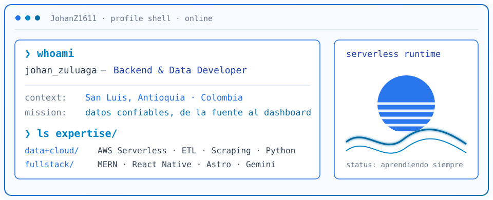
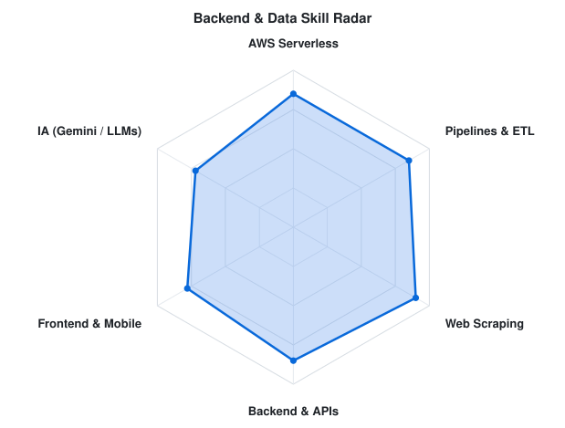
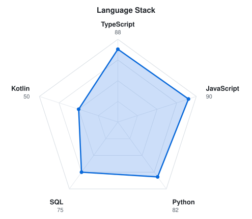

<a href="https://github.com/JohanZ1611">
  <picture>
    <source media="(prefers-color-scheme: dark)" srcset="assets/banner-dark.v9.svg">
    <source media="(prefers-color-scheme: light)" srcset="assets/banner-light.v9.svg">
    
  </picture>
</a>

 

---

## `$ whoami`

  <picture>
    <source media="(prefers-color-scheme: dark)" srcset="assets/whoami-dark.svg">
    <source media="(prefers-color-scheme: light)" srcset="assets/whoami-light.svg">
    
  </picture>

 

## `$ cat tech-stack.yaml`

<table border="1" cellpadding="14">
  <thead>
    <tr>
      <th colspan="2" align="left"><code>johan@homelab:~$ cat tech-stack.yaml</code></th>
    </tr>
  </thead>
  <tbody>
    <tr>
      <td width="50%" valign="top"><code>├─ ◈ frontend:</code>  
         
        <code>Astro · React · TypeScript · JavaScript · Tailwind · HTML · CSS</code>
      </td>
      <td width="50%" valign="top"><code>├─ ⚙ backend_apis:</code>  
         
        <code>Python · FastAPI · Node.js · Express · Prisma</code>
      </td>
    </tr>
    <tr>
      <td valign="top"><code>├─ ▣ databases:</code>  
         
        <code>PostgreSQL · Supabase · MongoDB · MySQL</code>
      </td>
      <td valign="top"><code>├─ ▢ mobile:</code>  
        
         
        <code>Expo · React Native · Kotlin · Android TV</code>
      </td>
    </tr>
    <tr>
      <td valign="top"><code>├─ ☁ devops_tools:</code>  
         
        <code>Docker · Cloudflare · Linux · Git · GitHub · Actions · VS Code</code>
      </td>
      <td valign="top"><code>╰─ ✦ ai_design_motion:</code>  
        
        
         
        <code>Gemini · GSAP · Sentry · Figma</code>
      </td>
    </tr>
  </tbody>
  <tfoot>
    <tr>
      <td colspan="2"><code>status: shipping&nbsp;&nbsp;·&nbsp;&nbsp;environment: production</code></td>
    </tr>
  </tfoot>
</table>

---

## `$ git log --stat --all-skills`

  <picture>
    <source media="(prefers-color-scheme: dark)" srcset="assets/radar-dark.svg">
    <source media="(prefers-color-scheme: light)" srcset="assets/radar-light.svg">
    
  </picture>&nbsp;
  <picture>
    <source media="(prefers-color-scheme: dark)" srcset="assets/radar-langs-dark.svg">
    <source media="(prefers-color-scheme: light)" srcset="assets/radar-langs-light.svg">
    
  </picture>

<code>signals: fullstack_skill_radar · language_stack_radar · status: healthy</code>

---

## `$ connect --socials`

&nbsp;&nbsp;
&nbsp;&nbsp;

 

Hecho con 💙 y mucho código · @JohanZ1611

