<div align="center">

<a href="https://github.com/JohanZ1611">
  <picture>
    <source media="(prefers-color-scheme: dark)" srcset="assets/banner-dark.v10.svg">
    <source media="(prefers-color-scheme: light)" srcset="assets/banner-light.v10.svg">
    
  </picture>
</a>

<br>

<a href="https://github.com/JohanZ1611">
  
</a>


</div>

---

## `$ whoami`

<p align="center">
  <picture>
    <source media="(prefers-color-scheme: dark)" srcset="assets/whoami-dark.svg">
    <source media="(prefers-color-scheme: light)" srcset="assets/whoami-light.svg">
    
  </picture>
</p>

<br>

<div align="center">

## `$ cat tech-stack.yaml`

<table border="1" cellpadding="14" bgcolor="#f1f5f9">
  <thead>
    <tr>
      <th colspan="2" align="left"><code>johan:~$ cat tech-stack.yaml</code></th>
    </tr>
  </thead>
  <tbody>
    <tr>
      <td width="50%" valign="top"><code>├─ ☁ cloud_infrastructure:</code><br><br>
        <br>
        <sub><code>AWS (Lambda · S3 · SQS · API Gateway · EventBridge · Secrets Manager · CloudWatch · ECR) · Serverless Framework · Azure (AZ-900) · Linux · Cloudflare</code></sub>
      </td>
      <td width="50%" valign="top"><code>├─ ▣ databases_messaging:</code><br><br>
        <br>
        <sub><code>MySQL (RDS) · PostgreSQL · MongoDB · Supabase · Firebase · Prisma</code></sub>
      </td>
    </tr>
    <tr>
      <td valign="top"><code>├─ ⚙ containers_dev_tools:</code><br><br>
        <br>
        <sub><code>Docker · Git · GitHub · GitHub Actions · Bash · VS Code · Postman/Bruno · DBeaver · Burp Suite · Sentry</code></sub>
      </td>
      <td valign="top"><code>├─ ◉ data_scraping_ai:</code><br><br>
        
        <br>
        <sub><code>Python · FastAPI · Puppeteer · BeautifulSoup/lxml · ETL · OCR · Google Gemini</code></sub>
      </td>
    </tr>
    <tr>
      <td valign="top"><code>├─ ✦ languages_frameworks:</code><br><br>
        <br>
        <sub><code>Node.js · JavaScript · TypeScript · Python · SQL · Express · React · Next.js · Java · Kotlin</code></sub>
      </td>
      <td valign="top"><code>╰─ ⌁ mobile_frontend_3d:</code><br><br>
        
        
        <br>
        <sub><code>React Native · Expo · Astro · Redux · Tailwind · Android Studio · Figma · Blender · GSAP</code></sub>
      </td>
    </tr>
  </tbody>
  <tfoot>
    <tr>
      <td colspan="2"><code>status: ready&nbsp;&nbsp;·&nbsp;&nbsp;environment: production</code></td>
    </tr>
  </tfoot>
</table>

</div>

---

## `$ git log --stat --all-skills`

<p align="center">
  <picture>
    <source media="(prefers-color-scheme: dark)" srcset="assets/radar-dark.svg">
    <source media="(prefers-color-scheme: light)" srcset="assets/radar-light.svg">
    
  </picture>&nbsp;
  <picture>
    <source media="(prefers-color-scheme: dark)" srcset="assets/radar-langs-dark.svg">
    <source media="(prefers-color-scheme: light)" srcset="assets/radar-langs-light.svg">
    
  </picture>
</p>

<p align="center"><sub><code>signals: backend_data_skill_radar · language_stack_radar · status: healthy</code></sub></p>

---

## `$ cat experience.yml`

```yaml
experience:
  - company: AssetMinder · Houston, TX (remoto)
    role: Backend & Data Developer (AWS) · 2023 – 2026
    highlights:
      - Autor principal de 5 servicios backend (600+ commits)
      - Datos financieros y operativos de 4 portales de property management (ResMan, RealPage, Entrata, AppFolio)
      - pmcs-entrata desde cero: scraping autenticado, RDS/MySQL, S3 y ~8 reportes de negocio
      - Migración de Lambda por capas a imagen de contenedor en ECR, con 2FA vía Keycloak
      - Reintentos con backoff en 10+ endpoints y rotación automática de credenciales cada 28 días
  - company: Independiente · Colombia (remoto)
    role: Full Stack Developer · 2023 – presente
    projects: [FastManage, Aurora Finance, AuroraPlay, Lance, Minga]
certifications:
  - Microsoft Certified: Azure Fundamentals (AZ-900)
  - Desarrollador Full Stack MERN · MindHub
  - AWS Certified Data Engineer – Associate (en proceso)
education:
  - Tecnología en Desarrollo de Videojuegos y Entornos Interactivos · SENA (en curso)
  - Diplomado en Aplicaciones Móviles · Misión TIC 2022, Universidad de Caldas (800 h)
languages: [Español (nativo), Inglés (A2 + lectura técnica)]
```

<p align="center"><sub><a href="https://www.credly.com/badges/9f8038d9-44de-4552-a235-9c01a00232fa/linked_in_profile">credencial Full Stack MERN en Credly</a></sub></p>

---

## `$ connect --socials`

<div align="center">

<a href="https://www.linkedin.com/in/johan-zuluaga-870343257">
  
</a>&nbsp;&nbsp;
<a href="https://github.com/JohanZ1611">
  
</a>&nbsp;&nbsp;
<a href="mailto:johan16zulu@gmail.com">
  
</a>

</div>

<br>

<div align="center">
<sub>Hecho con 💙 y mucho código desde San Luis, Antioquia, Colombia · @JohanZ1611</sub>
</div>
